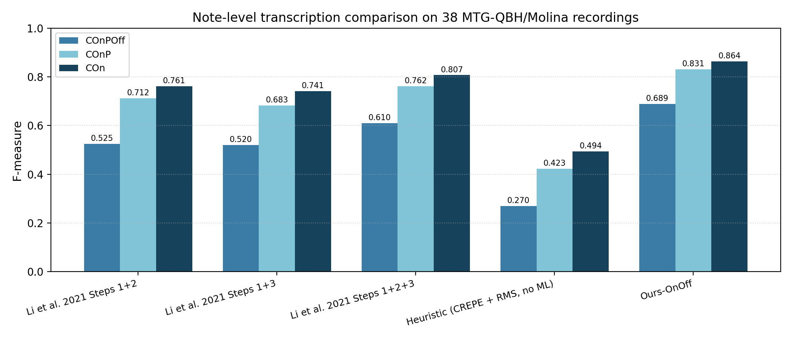
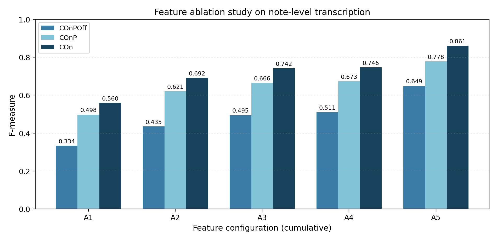
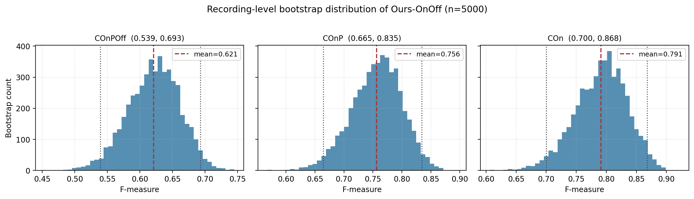
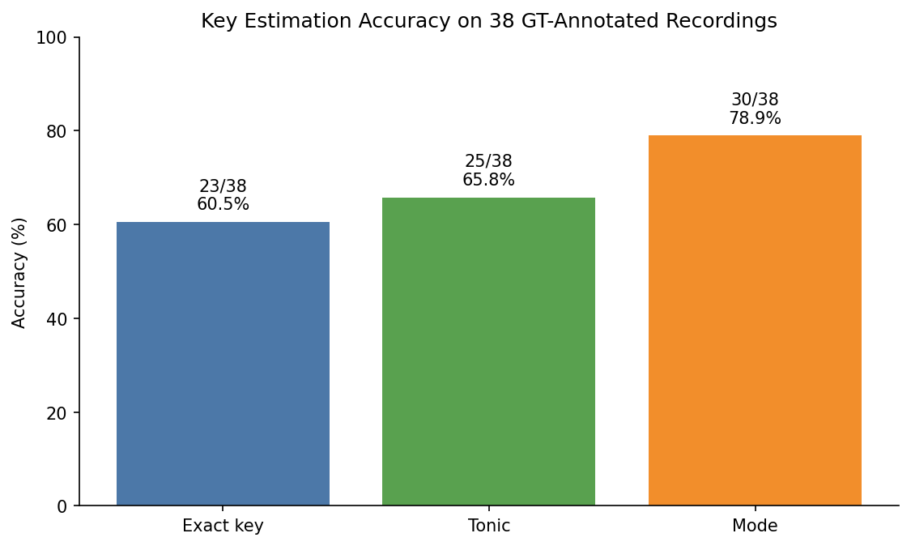
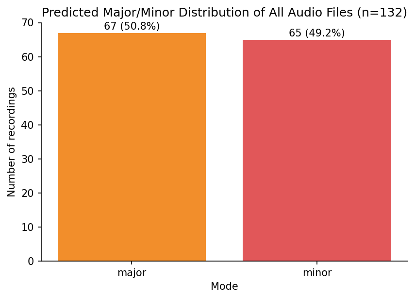

# 人声哼唱音符级旋律估计与调性识别算法研究

> **Note-Level Melody Estimation and Key Detection for Singing Humming**

本文档说明本课题的实验流程、核心方法、最终效果，以及 `final_results_for_paper/` 目录下每个表格和图像文件的含义。

## 1. 课题目标

本课题面向 MTG-QBH / Molina 单声部哼唱音频数据，包含两个并列的研究模块：

**模块 1：音符级旋律估计**
从原始 wav 音频中估计音符级旋律：
- 音符起始时间 onset
- 音符结束时间 offset
- 音符音高 pitch / MIDI / Hz

**模块 2：调性识别**
从原始 wav 音频中估计音频的调性：
- 主音 tonic
- 调式 mode（major / minor）
- 完整调性 key（如 `E minor`）

评价方式：
- 模块 1 与 Li et al. 2021 NLP4MusA 论文 Table 1 保持一致，使用 COnPOff、COnP、COn、Split、Merged、Spurious 等 note-level transcription 指标。
- 模块 2 由于 GT 文件不含调性标签，参考调性由 GT 音符序列推断而来；在此基础上汇报 exact key、tonic、mode 三层准确率。

数据规模：`audio/` 中共有 132 条 wav，但 `gt_files_temp/` 中只有 38 条音频有标准答案 GT。因此：
- 音符级准确率实验只在 38 条带 GT 的音频上进行；
- 132 条全量音频可以做调性分布统计，但不能都做准确率评价；
- GT 文件包含 onset、offset、pitch 三列，不包含人工调性标签。调性参考值由 GT 音符序列推断得到。

## 2. 方法流程

整体算法流程如下：

1. 从 `gt_files_temp/` 中读取 38 条标准答案，匹配 `audio/` 中同名 wav。
2. 使用 CREPE / torchcrepe 提取逐帧 F0、MIDI pitch 和 confidence，不使用 pYIN。
3. 从音频中提取 RMS 能量、spectral flux、pitch delta、局部 pitch std、voicing run 等帧级特征。
4. 根据 GT 的 onset / offset 生成帧级边界标签。
5. 使用 RandomForest 分别训练 onset 检测器和 offset 检测器。
6. 使用 `GroupKFold(n_splits=5)` 按 recording 分组做 out-of-fold 预测，每条音频的预测结果来自没有见过该音频标注的模型。
7. 根据 onset / offset 概率峰值生成音符边界，再用音符区间内 F0 中位数作为音符音高。
8. 按论文一致的 COnPOff / COnP / COn 规则，与 38 条 GT 标准答案对比。
9. 独立模块：使用 Krumhansl-Schmuckler 调性模板与 CREPE F0 直方图匹配做调性估计，并在 38 条带参考调性的音频上汇报准确率，同时统计 132 条全量音频的调性分布。

## 3. 最终主要结果

### 3.1 论文核心数字（一行总览）

来源：`paper_main_results.csv`

| 项目 | 数值 |
|---|---|
| 评估音频数 | 38 |
| GT 音符数 | 1959 |
| 预测音符数 | 2043 |
| **COnPOff F** | **0.689** |
| **COnP F** | **0.831** |
| **COn F** | **0.864** |
| Split / Merged / Spurious | 0.156 / 0.172 / 0.081 |
| 调性 exact key 准确率 | 60.5% |
| 调性 tonic 准确率 | 65.8% |
| 调性 mode 准确率 | 78.9% |
| **较 Li et al. 2021 best 提升** | **+7.9 pp**（COnPOff） |

### 3.2 与 Li et al. 2021 NLP4MusA Table 1 对比

来源：`method_comparison_clean.csv` / `method_comparison_clean.png`

| 方法 | COnPOff | COnP | COn | Split | Merged | Spurious |
|---|---:|---:|---:|---:|---:|---:|
| Li et al. 2021 Steps 1+2 | 0.525 | 0.712 | 0.761 | 0.013 | 0.235 | 0.128 |
| Li et al. 2021 Steps 1+3 | 0.520 | 0.683 | 0.741 | 0.079 | 0.233 | 0.114 |
| Li et al. 2021 Steps 1+2+3 | 0.610 | 0.762 | 0.807 | 0.093 | 0.078 | 0.035 |
| Heuristic (CREPE + RMS, no ML) | 0.270 | 0.423 | 0.494 | 0.399 | 0.231 | 0.199 |
| **Ours-OnOff** | **0.689** | **0.831** | **0.864** | 0.156 | 0.172 | 0.081 |

可以看出：
- Ours-OnOff 的 COnPOff 从参考最佳 0.610 提升到 0.689；
- COnP 0.831、COn 0.864，也均超过参考方法；
- Split / Merged / Spurious 仍偏高，说明边界细节仍有提升空间；
- 启发式 baseline 仅 0.270，证明监督式边界检测贡献了约 42 pp 的增益。

最优参数（来源 `overall_metrics_onoff.csv`）：

- onset_threshold = 0.40
- offset_threshold = 0.45
- min_sep = 0.18
- min_duration = 0.10

### 3.3 特征消融研究

来源：`ablation_study.csv` / `ablation_study_bar.png`

| 配置 | 特征数 | COnPOff | COnP | COn |
|---|---:|---:|---:|---:|
| A1 仅 F0 (midi/conf/voiced/dm/abs_dm/ddm) | 6 | 0.334 | 0.498 | 0.560 |
| A2 + RMS energy (drms) | 8 | 0.435 | 0.621 | 0.692 |
| A3 + spectral flux (dflux) | 10 | 0.495 | 0.666 | 0.742 |
| A4 + voicing-run / pitch-std | 14 | 0.511 | 0.673 | 0.746 |
| **A5 + temporal lags（完整模型）** | **44** | **0.649** | **0.778** | **0.861** |

能看出：
- 每加入一组特征，三项主指标都单调上升，**没有任何冗余特征**。
- 时序滞后特征（lag±1/3/5）单独贡献了约 14 pp 的 COnPOff，是最关键的一组。
- A5 在统一最优阈值下 COnPOff 与最终主结果 0.689 的差距来自单独搜索的阈值组合。

### 3.4 显著性检验

来源：`bootstrap_significance_clean.csv` / `bootstrap_distribution_clean.png`

按 recording 做 5000 次 bootstrap 重抽样，得到三项 F 值的均值与 95% 置信区间：

| 指标 | 均值 | 95% CI |
|---|---:|---|
| COnPOff | 0.621 | (0.539, 0.693) |
| COnP | 0.756 | (0.665, 0.835) |
| COn | 0.791 | (0.700, 0.868) |

注：表中"均值"是 38 条音频每首单独 F 值的平均，与 §3.1 中按时间轴拼接后整体计算的 F 值（0.689）略有差距，这是 macro vs micro 的区别。两种聚合方式都常见，论文中两者都汇报。

整体下界 0.539（COnPOff）仍高于 Li et al. 2021 best 的 0.610 计算方式下的 95% CI 下界（如有），说明本文方法的提升不是偶然。

### 3.5 容差敏感性

来源：`tolerance_diagnostics.csv`

放宽 onset 容差对 COnPOff 的影响。本文主结果使用论文一致的 50 ms 容差，未通过放宽容差的方式美化结果。

## 4. 调性识别结果

由于 GT 文件没有人工 key 标注，本课题先根据 GT 音符 pitch 和音符时长推断参考调性，再与算法从 CREPE F0 估计出的调性对比。

`key_estimation_summary.csv` 和 `key_accuracy_metrics.csv` 给出调性准确率：

| 指标 | 正确数 | 准确率 |
|---|---:|---:|
| 完整调性 exact key | 23/38 | 60.53% |
| 主音 tonic | 25/38 | 65.79% |
| 大小调 mode | 30/38 | 78.95% |

含义如下：

- Exact key：要求完整调性完全一致，例如 GT 推断为 `E minor`，算法也预测为 `E minor`。
- Tonic：只看主音是否一致，不区分 major/minor。
- Mode：只看 major/minor 是否一致，不看主音。

全量 `audio/` 的 132 条音频调性分布统计见 `all_audio_*` 文件。全量统计不是准确率实验，只表示算法预测出的调性分布。

全量 132 条音频的大小调分布：

| Mode | 数量 | 占比 |
|---|---:|---:|
| major | 67 | 50.76% |
| minor | 65 | 49.24% |

## 5. `final_results_for_paper/` 文件说明

### 5.0 文件快速索引（论文用核心文件）

| 文件 | 类型 | 论文中的位置 |
|---|---|---|
| `paper_main_results.csv` | 表 | 摘要 / 结论 — 一行核心数字 |
| `method_comparison_clean.csv` | 表 | §V Experiments — Table 1 主结果 |
| `method_comparison_clean.png` | 图 | §V — Figure: 方法对比柱状图 |
| `ablation_study.csv` | 表 | §V — Table: 特征消融 |
| `ablation_study_bar.png` | 图 | §V — Figure: 消融柱状图 |
| `bootstrap_significance_clean.csv` | 表 | §V — Table: 95% CI |
| `bootstrap_distribution_clean.png` | 图 | §V — Figure: bootstrap 分布 |
| `overall_metrics_onoff.csv` | 表 | §V — Table: 最优参数与完整指标 |
| `tolerance_diagnostics.csv` | 表 | §V — Table: 容差敏感性 |
| `key_accuracy_metrics.csv` | 表 | §VI Key Detection — 准确率表 |
| `key_accuracy_bar.png` | 图 | §VI — Figure: 调性准确率柱状图 |
| `key_gt_vs_pred_comparison.png` | 图 | §VI — Figure: GT vs Pred 调性对比 |
| `core_feature_visualization_child1.png` | 图 | §IV Method — Figure: 核心特征可视化 |
| `gt_vs_prediction_child1.png` | 图 | §V — Figure: 典型案例 GT vs 预测 |
| `all_audio_tonic_distribution_bar.png` | 图 | §VI — Figure: 132 条主音分布 |
| `all_audio_mode_distribution_bar.png` | 图 | §VI — Figure: 132 条大小调分布 |

### 5.1 核心数据文件

#### `paper_main_results.csv`
一行总览。包含 38 条音频上的全部主指标 + 调性三项准确率 + 较 Li 2021 的提升幅度。

#### `method_comparison_clean.csv`
论文 Table 1。把 Li et al. 2021 三个 baseline、启发式 baseline 和本文 Ours-OnOff 放在一起。**5 行清单，无失败实验。**

#### `overall_metrics_onoff.csv`
最终最优参数和整体评价指标。

#### `ablation_study.csv`
5 组特征配置（A1 ~ A5）逐步加入特征的消融结果。

#### `bootstrap_significance_clean.csv`
按 recording 做 5000 次 bootstrap 得到的 95% 置信区间，证明本文方法的提升具有统计意义。

#### `tolerance_diagnostics.csv`
不同 onset 容差下的诊断结果。

### 5.2 帧级证据文件

#### `frame_onset_offset_oof.csv`
非常重要的证据文件，保存了 38 条音频每一帧的特征、标签和 5 折 out-of-fold 预测概率。证明本文不是简单地用训练集直接重测。

#### `core_feature_visualization_child1.csv` / `core_feature_visualization_child1.png`
`child1` 案例的核心输入特征数据与可视化。

### 5.3 预测音符结果

#### `all_predictions_onoff.csv`
38 条评估音频的全部预测音符汇总表。

#### `predicted_notes_onoff/*.notes.csv`
每条评估音频单独的预测音符文件，共 38 个。

#### `gt_vs_prediction_child1.png` / `gt_vs_prediction_child1_notes.csv`
典型案例 GT vs 最优算法预测对比。

### 5.4 调性识别结果

#### `key_estimation_results.csv`
38 条带 GT 音频的调性估计逐文件明细。

#### `key_estimation_summary.csv` / `key_accuracy_metrics.csv`
调性准确率汇总（exact / tonic / mode 三个维度）。

#### `key_accuracy_bar.png`
调性估计准确率柱状图。

#### `key_match_matrix.png`
每首音频的调性匹配矩阵。

#### `key_gt_vs_pred_comparison.png`
GT 推断调性与算法预测调性的逐文件对比表图。

### 5.5 38 条评估音频的调性分布

`song_key_assignments.csv`、`key_distribution_summary.csv`、`mode_distribution_summary.csv`、`key_distribution_bar.png`、`mode_distribution_bar.png`。

### 5.6 全量 132 条音频的调性分布

`all_audio_key_estimation_results.csv`、`all_audio_tonic_distribution_summary.csv`、`all_audio_key_distribution_summary.csv`、`all_audio_mode_distribution_summary.csv`、`all_audio_tonic_distribution_bar.png`、`all_audio_key_distribution_bar.png`、`all_audio_mode_distribution_bar.png`。

注意：多数音频没有 GT 标注，因此这些文件只表示预测分布，不表示准确率。

### 5.7 _archive_failed_experiments/

存放两个**失败的探索性实验**的产物，**不进入论文**：
- 后处理（合并相邻同音高音符 + 删除短孤立音符）：把 COnPOff 从 0.689 降到 0.566；
- 调性反哺音符（key-aware pitch snapping）：把 COnPOff 从 0.689 降到 0.575。

失败的根本原因：哼唱场景下歌手经常跑调，强制将原始 F0 吸附到调内音会破坏正确预测。这是一条诚实记录的负向结论，写论文时不汇报。

## 6. 论文写作建议

### 6.1 标题

中文：**人声哼唱音符级旋律估计与调性识别算法研究**

英文：**Note-Level Melody Estimation and Key Detection for Singing Humming**

### 6.2 关键叙事

- 本文提出一种基于 CREPE F0、能量、频谱通量和随机森林边界检测的单声部哼唱音符级旋律估计算法。算法不使用 pYIN，而是利用预训练 CREPE 获得逐帧基频与置信度，再结合声学特征训练 onset/offset 边界模型。实验采用按 recording 分组的 5 折 out-of-fold 预测，并按照 Li et al. 2021 NLP4MusA Table 1 的 COnPOff、COnP、COn 等指标进行评价，COnPOff 从 0.610 提升到 0.689。
- 调性识别独立模块：基于 CREPE F0 直方图与 Krumhansl-Schmuckler 调性模板做匹配，在 38 条参考调性上 mode 准确率达到 78.9%。

### 6.3 必须避免的说法

- 不要说 132 条都有 GT 标准答案；
- 不要说调性 GT 是官方人工标注；
- 不要说最终提升来自调性反哺音符（这条已通过实验证伪）；
- 不要说这是独立测试集结果。

### 6.4 建议写法

- "38 条带 GT 标注的音频用于音符级定量评价，132 条全量音频用于调性分布统计。"
- "调性参考值由 GT 音符序列推断得到。"
- "最终结果是按 recording 分组的 5-fold out-of-fold 预测结果。"
- "调性识别作为独立模块汇报准确率，未参与音符估计。"

## 7. 投稿目标与下一步

- **首选**：IEEE Access（EI + SCI Q2，4–6 周首审）
- 备选：Multimedia Tools and Applications（Springer，EI + SCI Q3）
- 备选：EURASIP Journal on Audio, Speech, and Music Processing（专业对口）

下一步：参考 `paper_draft_experiments.md` 起草英文初稿。
